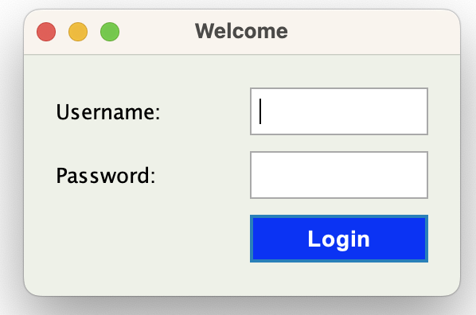
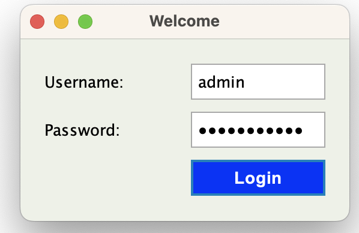
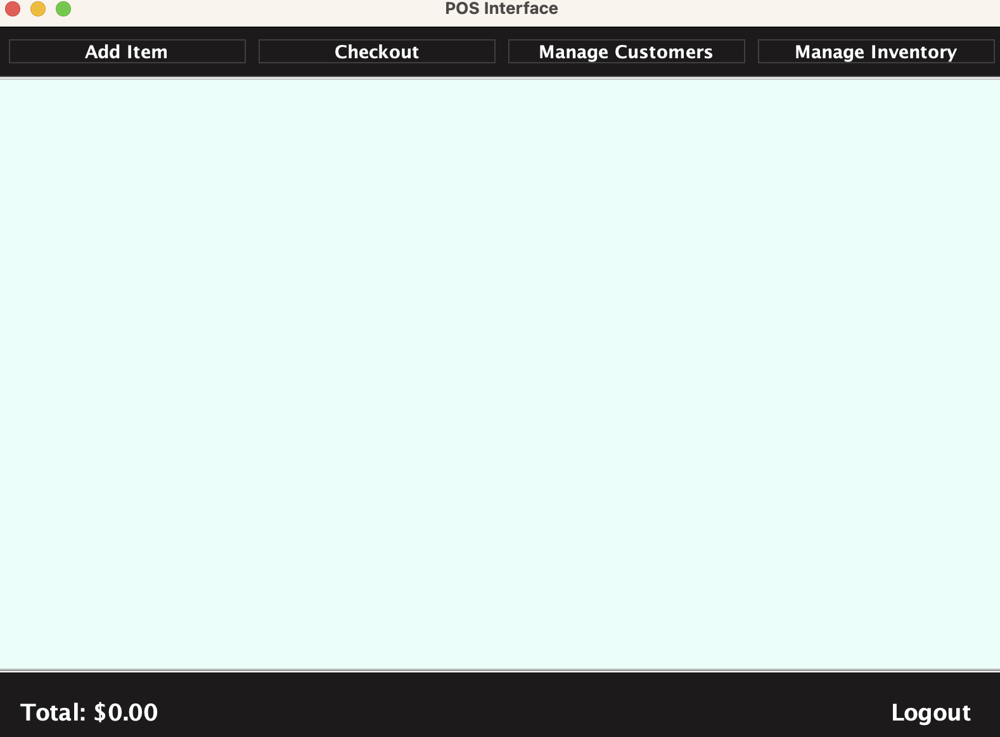
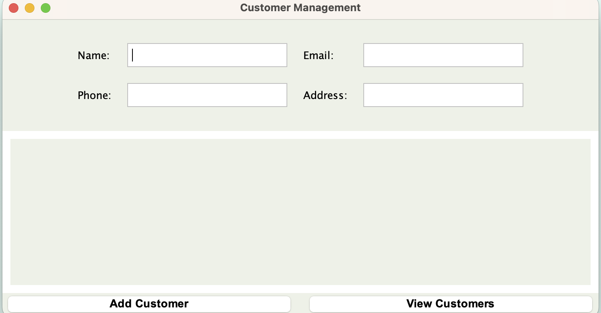
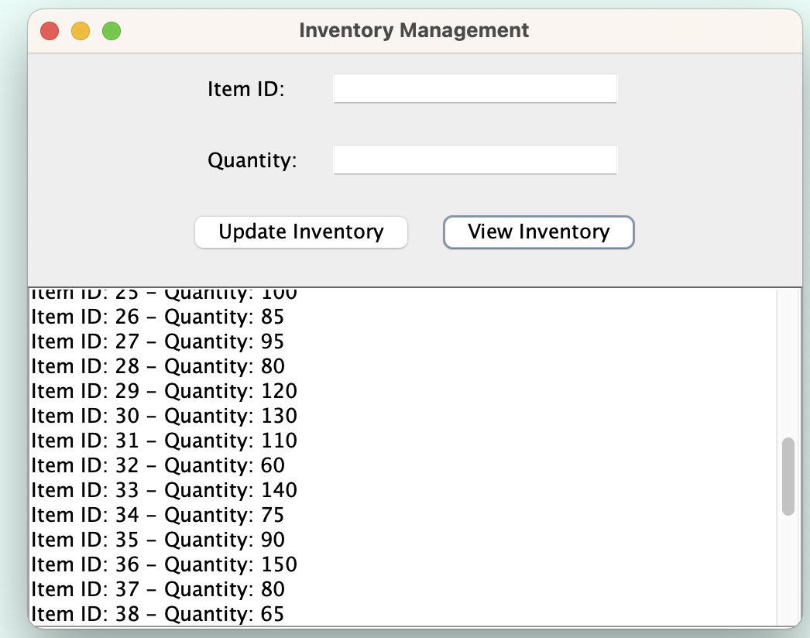
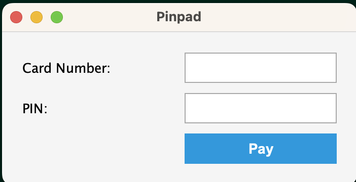
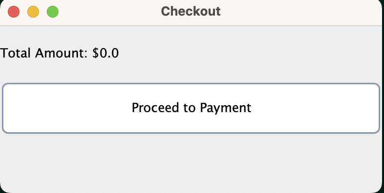
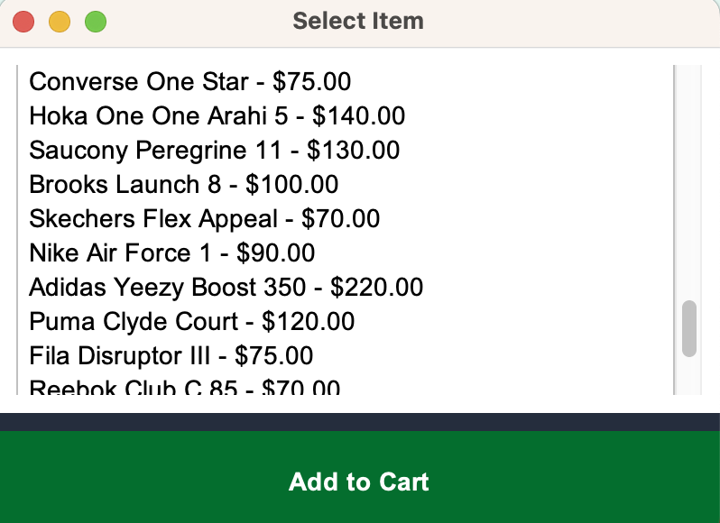
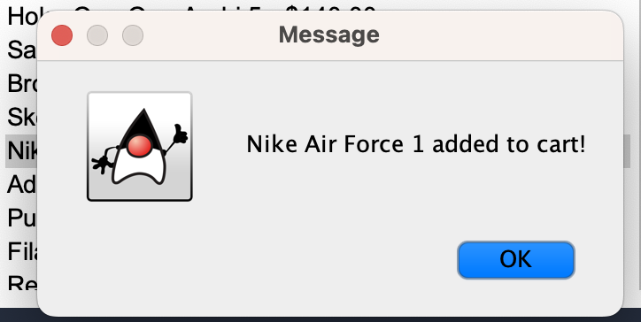
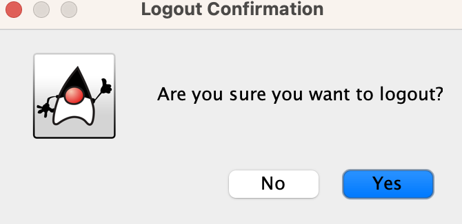

# Retail POS System

## Description

The Retail POS System is a Java-based application designed to facilitate point-of-sale transactions in a retail environment. This project integrates user authentication, transaction management, customer and inventory management, and secure payment processing, providing a comprehensive solution for retail operations. It includes functionalities for managing inventory, processing transactions, and handling customer data.The system includes a simulated pinpad to mimic real hardware, allowing users to securely enter payment information during transactions. The application features a secure login/logout system with role-based access, enabling different functionalities based on user roles such as Admin, Cashier, and Inventory Manager.

# Project Directory

```

├── src/
│   ├── main/
│   │   ├── java/
│   │   │   └── com/
│   │   │       └── retailpos/
│   │   │           ├── ui/                  # UI components
│   │   │           │   ├── MainPOSFrame.java
│   │   │           │   ├── LoginPanel.java
│   │   │           │   ├── CustomerPanel.java
│   │   │           │   ├── InventoryPanel.java
│   │   │           │   ├── SelectItemPanel.java
│   │   │           │   ├── CheckoutPanel.java
│   │   │           │   └── PinpadFrame.java
│   │   │           ├── service/              # Service layer
│   │   │           │   ├── TransactionService.java
│   │   │           │   └── PaymentService.java
│   │   │           ├── util/                 # Security features
│   │   │           │   ├── SessionManager.java
│   │   │           │   ├── EncryptionUtil.java
│   │   │           │   └── UserManager.java
│   │   │           ├── integration/          # Database integration
│   │   │           │   ├── DatabaseManager.java
│   │   │           │   └── StripeIntegration.java
│   │   │           └── model/                # Model classes
│   │   │               ├── Customer.java
│   │   │               ├── Inventory.java
│   │   │               ├── Item.java
│   │   │               └── Transaction.java
│   │   └── resources/
│   │       └── application.properties         # Configuration file
│   └── test/
│       └── java/
│           └── com/
│               └── retailpos/
│                   └── ...                   # Test classes
├── pom.xml                                    # Maven configuration file
```

## Features

- **User Authentication**: Secure login with role-based access control (Admin, Cashier, Inventory Manager).
- **Item Management**: Dynamic item selection from a database, allowing for easy addition to the cart.
- **Customer Management**: Interface for managing customer information and transactions.
- **Inventory Management**: Track and manage product stock levels.
- **Checkout Process**: Seamless transaction handling with total calculation and payment processing.
- **Payment Integration**: Utilizes Stripe API for secure payment processing.
- **Session Management**: Ensures user sessions are validated and secure, with session timeout capabilities.

## Security Features

1. **Password Hashing**: User passwords are securely hashed using the BCrypt algorithm before storing in the database, ensuring sensitive information is protected.
2. **Session Management**: User sessions are managed effectively, with automatic expiration to enhance security. Users must re-authenticate after a timeout.
3. **Role-Based Access Control**: Different user roles provide varying levels of access to the application, preventing unauthorized actions.
4. **Input Validation**: All user inputs are validated to prevent SQL injection and other common attacks.

## Database Implementation

- **Database Type**: The application uses a relational database (MySQL) to store user credentials, product information, and transaction records.
- **Connection Configuration**: Database connection details (DB_URL, USER, PASSWORD)
- **Data Access Layer**: The application follows a DAO (Data Access Object) pattern to abstract database interactions, promoting cleaner code and easier maintenance.

## Technology Stack

- **Java**: Core programming language used for developing the application.
- **Swing**: For creating the graphical user interface (GUI).
- **MySQL**: Database management system to store user, item, and transaction data.
- **BCrypt**: For password hashing and secure storage.
- **Stripe API**: For payment processing .

## Screenshots

Here are some screenshots of the application in action:





















> The system will be updated further....
